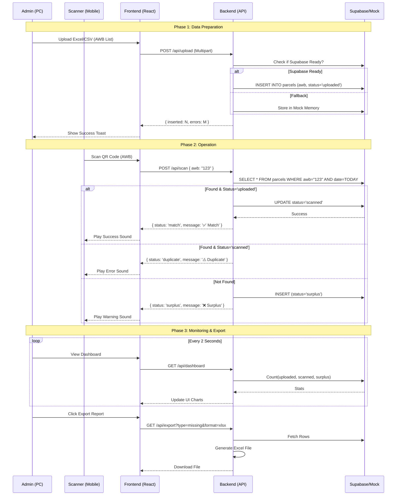

# End-to-End System Flow

## Overview
This document illustrates the complete workflow of the Sudprodshop Checkout System, covering the User Journey and Data Flow.

## 1. Sequence Diagram: Upload & Scan Process



## 2. System Architecture Flowchart

```mermaid
graph TD
    UserPC[User (PC)] -->|Upload/Monitor| DashboardUI[Dashboard UI]
    UserMobile[User (Mobile)] -->|Scan QR| ScannerUI[Scanner UI]
    
    DashboardUI -->|HTTP Requests| API[API Gateway / Backend]
    ScannerUI -->|HTTP Requests| API
    
    API -->|Route: /api/upload| HandlerUpload[Upload Handler]
    API -->|Route: /api/scan| HandlerScan[Scan Handler]
    API -->|Route: /api/dashboard| HandlerDash[Dashboard Handler]
    
    HandlerUpload --> Logic{Supabase Ready?}
    HandlerScan --> Logic
    HandlerDash --> Logic
    
    Logic -->|Yes| Supabase[(Supabase DB)]
    Logic -->|No| MockService[(In-Memory Mock)]
    
    Supabase -->|Real-time Data| API
    MockService -->|Session Data| API
```
